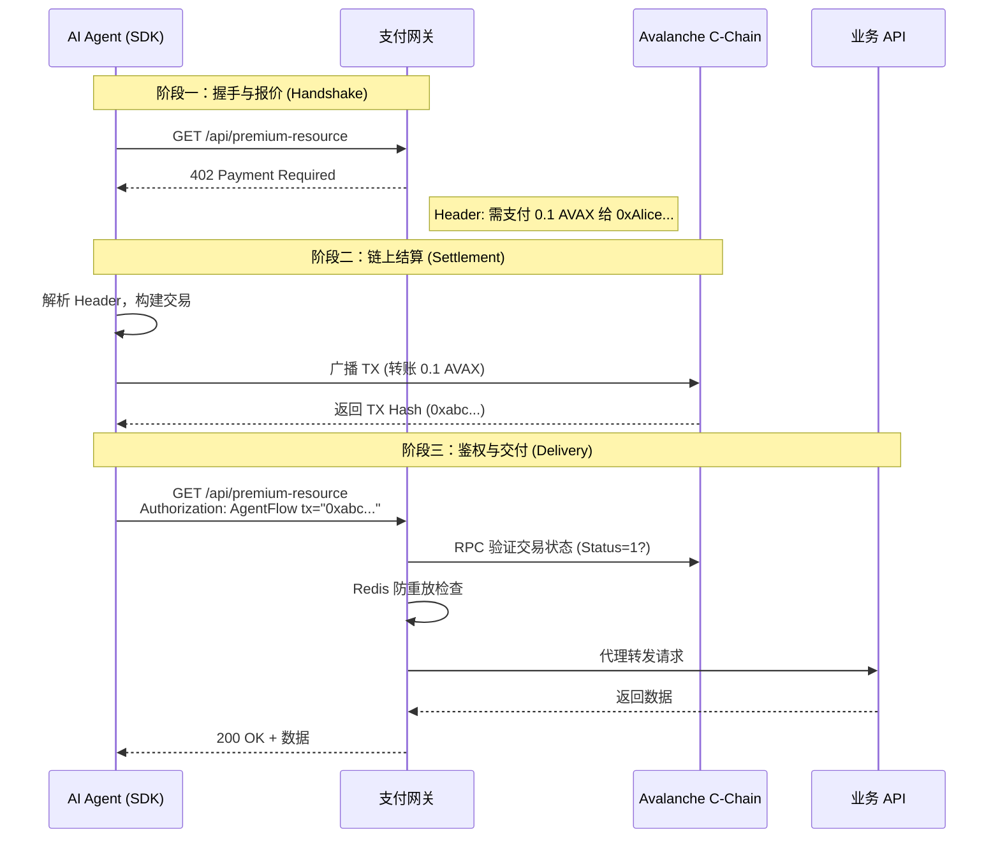

# AgentFlow 协议白皮书：构建 AI 时代的机器经济基础设施

**版本:** 3.0 (Final Architecture)
**日期:** 2026年1月
**作者:** AgentFlow Labs
**状态:** Avalanche Build Games 参赛作品

---

## 1. 愿景 (Vision)

### 1.1 从信息互联网到价值互联网
过去三十年，HTTP 协议让“信息”在全球范围内实现了零摩擦流动。任何人都可以免费地创建网页，任何人都可以免费地访问网页。然而，当涉及到“价值”的流动时，互联网依然停留在前数字时代。

我们要么依赖于广告（出卖用户隐私），要么依赖于订阅制（低效的包月付费），要么依赖于复杂的第三方支付网关（Stripe/PayPal）。这些系统有一个共同的假设：**用户是人类**。

### 1.2 AI 的崛起与支付的缺失
随着 LLM（大语言模型）和 Autonomous Agents（自主智能体）的爆发，互联网正在迎来新的居民：**硅基生命**。
*   AI 需要实时获取最新的金融数据进行分析。
*   AI 需要调用其他 AI 的能力（例如 GPT-4 调用 Midjourney 绘图）。
*   AI 需要租用计算资源来完成复杂的推理任务。

然而，AI 没有银行账户，没有信用卡，无法通过 KYC，也无法点击“我不是机器人”的验证码。现有的金融基础设施将 AI 拒之门外，迫使每一个 AI 背后都必须站着一个人类来为它买单。这严重限制了 AI 的自动化潜力和经济效率。

### 1.3 AgentFlow 的使命
AgentFlow 的使命是 **为机器经济 (Machine Economy) 构建原生支付层**。

我们致力于复活 HTTP 协议中沉睡已久的 `402 Payment Required` 状态码，并结合 Avalanche 网络的高性能结算能力，打造一个**去中心化、无许可、原子化结算**的支付标准。

在这个网络中：
*   **支付即协议:** 支付不再是外挂的插件，而是 HTTP 通信的原生部分。
*   **代码即法律:** 没有人工审核，没有退款纠纷，一手交钱一手交货。
*   **万物皆可定价:** 从一条数据库记录到一次 API 调用，万物皆可被精确计价并实时交易。

---

## 2. 核心问题与解决方案 (Problem & Solution)

### 2.1 传统支付的痛点
对于 AI Agent 而言，传统支付存在“三座大山”：
1.  **交互摩擦:** 信用卡输入、短信验证码、3D-Secure 验证，这些设计初衷是防范人类欺诈，但对自动化程序来说是致命的阻断。
2.  **信任成本:** 预充值模式（Pre-paid）要求用户信任平台不跑路；后付费模式（Post-paid）要求平台信任用户不赖账。
3.  **最小颗粒度:** 由于法币支付体系的高昂固定成本（每笔 $0.30+），使得“微支付”（例如 $0.01 的 API 调用）在经济上不可行。

### 2.2 AgentFlow 的解决方案
AgentFlow 提出了一种基于 **HTTP 402 + Avalanche C-Chain** 的全新架构：

*   **机器原生接口:** 使用标准 HTTP Header 传输支付指令，AI 仅需解析 JSON 即可完成支付，无需任何 UI 交互。
*   **原子化微支付:** 利用 Avalanche 的低 Gas 费和亚秒级确认，我们实现了“请求即交易”。哪怕是 0.001 AVAX 的金额，也能在链上低成本结算。
*   **零信任原子交换:** 支付与服务交付绑定在同一个 HTTP 会话周期内。不付钱不给数据，给了钱必给数据（链上可查）。

### 2.3 通俗类比：数字世界的自动售货机 (Analogy)

如果说传统的订阅制（Subscription）像是**健身房会员**——你必须签合同、付月费，哪怕你一个月只去一次，甚至还没进门就要先验明正身（KYC）；

那么 AgentFlow 就像是一台**自动售货机**：
1.  **无需身份:** 售货机不关心你是谁，也不需要你注册账号。
2.  **无需合同:** 你不需要承诺下个月还来买。
3.  **即时结算:** 你投币（发送 AVAX），它出货（返回数据）。
4.  **按需付费:** 想喝一瓶水就付一瓶水的钱。

在 AI 的世界里，AgentFlow 就是这台部署在网络边缘的自动售货机，让无数的 AI 智能体可以随时随地“投币”获取它们需要的“燃料”（数据与算力）。

---

## 3. 技术架构 (Technical Architecture)

### 3.1 系统拓扑图 (System Topology)

AgentFlow 采用典型的分层架构，连接了链下的业务逻辑与链上的价值网络。

```mermaid
graph TB
    subgraph Client_Layer [客户端层 (AI Agent)]
        Agent[AI Agent 业务逻辑]
        SDK[AgentFlow SDK]
        Wallet[本地私钥管理器]
    end

    subgraph Network_Layer [网络传输层]
        HTTP[HTTP / HTTPS]
        Header[Header: WWW-Authenticate / Authorization]
    end

    subgraph Service_Layer [服务层 (Resource Provider)]
        Gateway[AgentFlow 支付网关]
        Cache[(Redis: 防重放缓存)]
        API[上游业务 API / 数据库]
    end

    subgraph Blockchain_Layer [区块链层 (Avalanche)]
        RPC[Avalanche RPC 节点]
        CChain[C-Chain 共识网络]
    end

    Agent -->|1. 发起请求| SDK
    SDK -->|2. 封装协议头| HTTP
    HTTP -->|3. 拦截与鉴权| Gateway
    Gateway -->|4. 状态校验| Cache
    Gateway -->|5. 交易验证| RPC
    RPC -->|6. 账本查询| CChain
    Gateway -->|7. 放行请求| API
```

### 3.2 核心交互时序 (Core Interaction Sequence)

AgentFlow 定义了一套严格的“握手-挑战-响应”流程：



### 3.3 协议交互流程详解

#### 第一阶段：发现与报价 (Discovery & Quote)
当 Client (Agent) 首次访问受保护资源时，Server (Gateway) 拒绝请求。
*   **Request:** `GET /api/gpt-5-prediction`
*   **Response:** `402 Payment Required`
*   **Header:** `WWW-Authenticate: AgentFlow realm="Avalanche", recipient="0x123...", amount="0.5", currency="AVAX", resource_id="res_9981"`

> **技术细节:** Header 中包含了完成支付所需的一切信息：谁收钱 (recipient)、收多少 (amount)、在哪个链 (Avalanche C-Chain)。

#### 第二阶段：链上结算 (On-Chain Settlement)
Client SDK 捕获 402 错误，自动调用本地钱包。
*   **Action:** 构造一笔标准的 EVM Transaction。
    *   `to`: `0x123...` (从 Header 获取)
    *   `value`: `0.5 AVAX` (从 Header 获取)
    *   `data`: `0x...` (可选，包含 resource_id 的哈希，用于链上存证)
*   **Network:** 广播至 Avalanche C-Chain。
*   **Wait:** 等待 Snowman 共识确认（约 1-2 秒）。

#### 第三阶段：授权与交付 (Authorization & Delivery)
Client 获得交易哈希 (TX Hash)，再次发起 HTTP 请求。
*   **Request:** `GET /api/gpt-5-prediction`
*   **Header:** `Authorization: AgentFlow tx="0xabc789..."`

Server 收到请求后，执行验证逻辑：
1.  **RPC 查询:** 向 Avalanche 节点查询该 TX 的详情。
2.  **三维校验:**
    *   `tx.to == me?` (防止挪用他人交易)
    *   `tx.value >= price?` (防止金额不足)
    *   `tx.status == 1?` (防止失败交易)
3.  **防重放 (Anti-Replay):** 检查 Redis 中是否存在该 Hash。若无，则存入并放行；若有，则拒绝。

### 3.2 为什么选择 Avalanche?
AgentFlow 的核心体验在于**“同步感”**。AI 发起请求后，必须在 HTTP 超时（通常 30秒）内完成支付并拿到数据。
*   **Ethereum L1:** 12秒出块，Finality 需要 15分钟。不可用。
*   **Optimistic L2:** 虽快，但在提款期和抗审查性上存在妥协。
*   **Avalanche:** 独有的 Snowman 共识机制提供了 **< 1秒的不可逆终局性 (Finality)**。这是目前唯一能支持 HTTP 同步支付体验的区块链基础设施。

---

## 4. 安全模型 (Security Model)

### 4.1 票据核销机制 (Ticket Burning)
为了防止“一票多用”（重放攻击），AgentFlow 网关实现了一套票据核销机制。
*   所有验证通过的 TX Hash 都会被写入高可用缓存（Redis Cluster）。
*   设置 TTL（生存时间）为 1 小时。
*   网关拒绝任何 `block_timestamp` 早于 1 小时前的交易。
*   **结果:** 形成了一个闭环，攻击者无法使用旧交易，也无法复用新交易。

### 4.2 零知识隐私保护 (ZKP - Roadmap)
在未来版本中，我们将引入零知识证明。Agent 无需直接发送 TX Hash（暴露钱包地址），而是发送一个 ZK-Proof，证明“我拥有一个支付给你的有效交易”，从而隐藏 AI 背后的控制者身份。

---

## 5. 应用场景与生态 (Ecosystem Use Cases)

### 5.1 数据乐高 (Data LEGOs)
*   **场景:** AI 投研 Agent 需要聚合 Bloomberg、Twitter、链上数据。
*   **现状:** 需要分别购买三个平台的年费会员，成本极高。
*   **AgentFlow:** Agent 仅需为它抓取的那 **几条** 特定数据付费。按条计价，用完即走。

### 5.2 算力租赁 (Compute Rendering)
*   **场景:** 一个轻量级 Agent 需要生成一张 4K 图片，但自己没有 GPU。
*   **AgentFlow:** 它向“算力市场 API”发送请求，附带 0.1 AVAX。算力节点收到钱后，自动调用本地 GPU 生成图片并返回。

### 5.3 创作者经济 (Creator Economy)
*   **场景:** 独立开发者开发了一个很棒的图像处理算法。
*   **AgentFlow:** 他只需在 Nginx 上部署 AgentFlow 插件。任何人的代码、任何人的 Agent 都可以调用这个 API，开发者直接收到 AVAX，无需注册公司，无需接入 Stripe。

demo:


---

## 6. 结语 (Conclusion)

AgentFlow 不仅仅是一个协议，它是一场关于互联网基础架构的实验。

我们在尝试回答一个问题：**如果互联网从一开始就内置了货币，世界会变成什么样？**

在 AI 时代，我们相信机器之间的协作将超越人类的想象。而 AgentFlow 提供的，正是润滑这台巨大机器运转的“数字机油”。通过 Avalanche 的力量，我们正在把每一次点击、每一次请求、每一次计算，都变成可编程、可结算的价值流动。

**AgentFlow: Build the Economy of Agents.**
